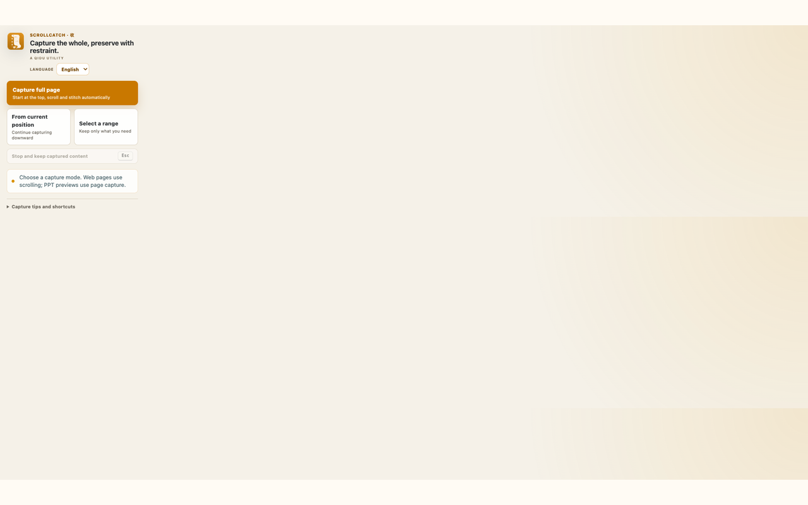
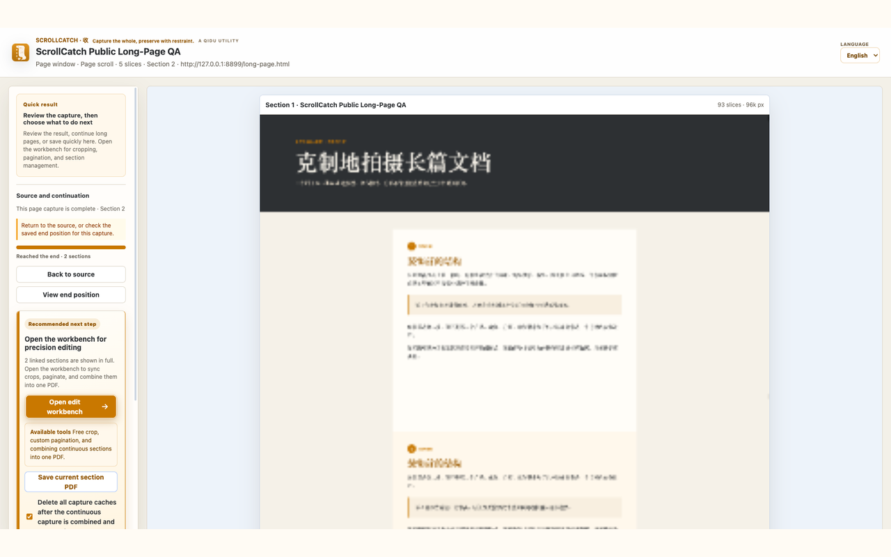
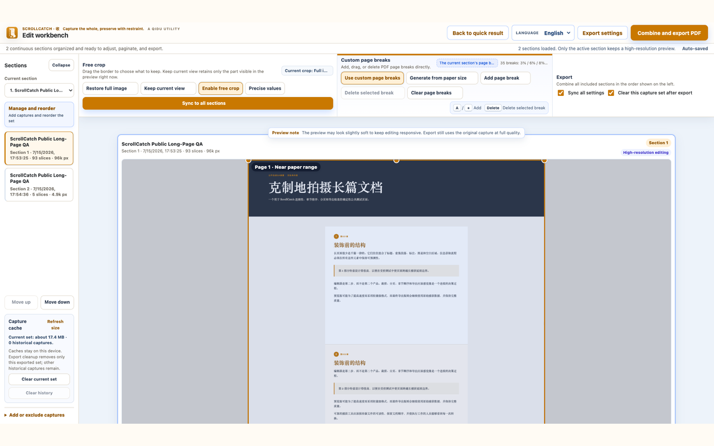
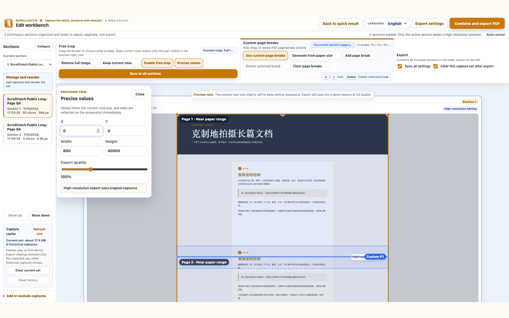
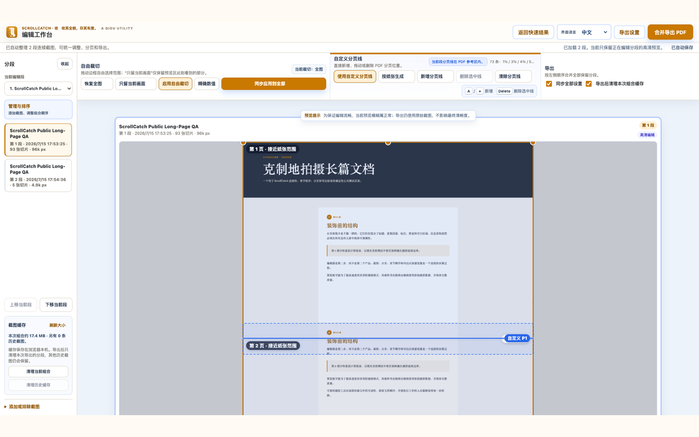

# ScrollCatch — Full Page Capture

> 收其全貌，存其有度。 · Capture the whole, preserve with restraint. · A QIDU Utility

一个以完整网页截图为核心的 Chromium 浏览器扩展。当前发布版本为 `1.2.0`。

隐私政策：[`PRIVACY.md`](./PRIVACY.md)

GitHub：<https://github.com/Yifo98/ScrollCatch>

## 1.2.0 更新摘要

- 使用最终 QIDU 方向完成品牌升级，统一暖白、琥珀金、炭黑界面与卷轴图标。
- 项目目录和 GitHub 仓库统一更名为 `ScrollCatch`，并保留旧版语言选择和编辑草稿的兼容读取。
- 产品名称保持 `ScrollCatch — Full Page Capture`，默认使用 English，并记忆用户选择的中文界面。
- 截图后先显示轻量“快速结果”，裁切、自定义分页、多段排序、缓存管理和合并导出集中到统一的编辑工作台。
- 完善超长页面分段续截、回到原文和保存终点恢复；截图中可用 `Esc` 或浏览器快捷键停止。
- 多段截图可调整顺序、同步裁切与导出设置，并按每段尺寸重新生成分页线后合并导出 PDF。
- A3、A4、A5、B5、Letter、Legal、Tabloid 及横竖方向会写入真实 PDF 页面尺寸；工作台同步重算分页参考区。
- 保留并加强飞书 PPT / Lark 演示文稿按页捕获和分页图片、PDF 导出。

## 界面预览











适用浏览器：

- Google Chrome
- Microsoft Edge
- ChatGPT Atlas
- 其他支持 Chromium 扩展的浏览器

## 功能

- 一键捕获当前标签页的完整页面。
- 自动识别页面主体滚动或内部滚动容器。
- 智能识别打开后的飞书 PPT、Lark 演示文稿和类似在线预览页，并自动按页捕获。
- 支持常见文档、知识库、后台系统、长网页截图。
- 支持同页 iframe 的滚动捕获尝试。
- 点击扩展图标后可选择 `截取完整页面`、`从当前位置` 或 `框选范围`。
- 自定义范围会在页面上显示横向参考线和控制条：移动鼠标定位后点击页面正文或 `标记起点`，滚动到目标位置后点击页面正文或 `标记终点`；点击滚动条不会被当成终点；如果不想手动选终点，按 `Enter` 会一直截到页面结束。
- 滚动截图过程中可按 `Esc` 停止；切到其他标签后源页面收不到 `Esc` 时，可用 `Alt+Shift+S` 或扩展弹窗停止。
- 截图过程中切到其他标签时会暂停等待源页面回到前台，不会把其他页面截进去。
- 超长页面会按段捕获；到达单段上限后会保存结束位置，可一键继续截取下一段。
- 快速结果始终提供 `回到原文`；原标签页已经关闭时，会重新打开原网页。
- 单段与连续多段共用一个 `编辑工作台` 入口：单段直接精修，多段自动整理为连续内容，不再经过单独的合并工作台。
- 弹窗、快速结果和编辑工作台默认使用 English；语言入口带有明确的 `Language / 界面语言` 标签，切换中文后会在浏览器本机记住选择，下次打开继续使用中文。
- 旧版缓存、手动从当前位置截出的分段或独立 PPT 截图，仍可在编辑工作台的 `添加其他截图` / `添加或排除截图` 中补选、排除和排序，功能不会因自动分组而丢失。
- 截图完成后先进入快速结果；连续截图会以轻量卡片依次显示全部相连分段，不进入工作台也能确认前后内容是否完整。
- 快速结果左侧首先推荐 `进入编辑工作台`，其次提供 `保存当前段 PDF`；PNG、JPEG 和分页图片收在 `更多导出格式`。
- 工作区预览如有模糊属正常，PNG、JPEG 和分页导出都会重新读取原始切片。
- 支持导出：
  - PNG 长图
  - JPEG 长图
  - 分页 PNG ZIP
  - 分页 JPEG ZIP
  - 分页 PDF
- 支持高级 PDF 参数：纸张尺寸、横版 / 竖版、页脚页码和导出清晰度。
- 支持裁切选区、拖拽边框和预览缩放。
- 支持自定义分页线，适合手动调整每一页的内容范围。
- 自定义分页线会显示 PDF 参考虚线区，并实时提醒偏长、偏短导致的 PDF 缩放变形风险。
- 支持选中并删除单条自定义分页线。
- 支持键盘新增和删除分页线。
- 左侧功能区支持独立滚动，长页面编辑时不会被右侧预览滚动卡住。
- 超长页面会自动按比例降采样拼接，避免结果页一打开就被浏览器画布限制拦住。
- 分页 PNG、分页 JPEG 和分页 PDF 会从原始截图切片逐页渲染，尽量保持原始清晰度。
- 自动保存编辑草稿，结果页刷新后会尽量恢复裁切和分页设置。
- 支持查看、打开、删除历史截图缓存，或清空全部截图缓存；快速结果和编辑工作台默认勾选导出后自动删除本次缓存，也可在导出前取消。未完成的长页和已关联的多段会保留到最终合并导出，避免中途删除后无法续截或合并。
- 默认保留最近 12 条截图缓存，方便连续截取多节后合并。

## 安装

### Chrome

1. 解压 `ScrollCatch-1.2.0.zip`。
2. 打开 `chrome://extensions/`。
3. 打开右上角 `Developer mode`。
4. 点击 `Load unpacked`。
5. 选择解压后的 `ScrollCatch-1.2.0` 文件夹。

### Edge

1. 解压 `ScrollCatch-1.2.0.zip`。
2. 打开 `edge://extensions/`。
3. 打开 `Developer mode`。
4. 点击 `Load unpacked`。
5. 选择解压后的 `ScrollCatch-1.2.0` 文件夹。

### Atlas

1. 解压 `ScrollCatch-1.2.0.zip`。
2. 优先尝试打开 `chrome://extensions/`。
3. 如果没有进入扩展管理页，就从浏览器工具栏的扩展入口进入管理页面。
4. 打开开发者模式后，选择 `Load unpacked`。
5. 选择解压后的 `ScrollCatch-1.2.0` 文件夹。

### Windows 智能应用控制

ScrollCatch 是由 Chrome / Edge 加载的浏览器扩展，不是 Windows 桌面应用。正式发布包只包含扩展所需的 HTML、CSS、JavaScript、图片和清单文件，不包含 `.exe`、`.msi`、`.dll` 或独立启动程序，因此不需要为 ScrollCatch 购买 Windows EXE 代码签名证书。

Windows 用户应优先从 Chrome Web Store 安装；使用 GitHub ZIP 时，解压后按照上面的 Chrome / Edge 步骤选择 `Load unpacked`。ScrollCatch 不需要 BAT 启动器，BAT 也不是绕过 Windows 安全策略的通用方案：它启动的任何原生程序仍会接受对应的应用控制检查。

发布脚本会主动拒绝混入 `.exe`、`.msi`、`.dll`、`.bat`、`.cmd`、`.ps1` 等 Windows 可执行、安装或启动包装，避免未来把浏览器扩展误打包成需要额外信任链的桌面程序。

微软官方规则、BAT 边界和本项目审计结论见 [`docs/windows-smart-app-control.md`](./docs/windows-smart-app-control.md)。

## 使用

1. 打开需要截图的网页。
2. 点击浏览器工具栏里的 `ScrollCatch` 图标。
3. 选择 `截取完整页面`、`从当前位置` 或 `框选范围`。飞书 PPT 建议先点开 PPT 预览页，再点 `截取完整页面`，扩展会自动按页捕获。如果你已经手动滚到想接着截的位置，直接选 `从当前位置`。自定义范围模式下，移动鼠标定位后点击页面正文或页面左下角的 `标记起点`；选定起点后页面会实时显示当前框选范围的宽 × 高和半透明预览区；滚动到目标位置后点击页面正文或 `标记终点`。按 `Esc` 可随时取消，按 `Enter` 会截到页面结束。
4. 等待扩展自动滚动并截图；如果想提前结束，可在源页面按 `Esc`，也可再次点击扩展里的 `停止捕获`。切到其他标签后，如果源页面收不到 `Esc`，可按 `Alt+Shift+S` 停止。
5. 完整截图可以随时点击 `回到原文`。如果提示已到达单段上限，可以先点 `查看结束位置` 确认衔接处；导出当前段后再点击 `继续截取下一段`，扩展会自动回到保存的位置并开始下一段。
6. 快速结果打开后，先确认截图是否完整。连续截图会显示全部相连分段；左侧首先推荐 `进入编辑工作台`，其次可以直接保存当前段 PDF，PNG、JPEG 和分页图片位于 `更多导出格式`：
   - `保存当前段 PDF`：快速导出当前分段；需要合并全部分段时进入编辑工作台。
   - `保存 PNG`：导出一张完整长图；长页未完成时会明确标为保存当前段。
   - `保存 JPEG`：导出一张完整长图，文件通常更小。
   - `分页 PNG`：按当前纸张和分页线从原始切片逐页导出多张 PNG，打包为 ZIP。
   - `分页 JPEG`：按当前纸张和分页线从原始切片逐页导出多张 JPEG，打包为 ZIP。
   - `导出 PDF`：按当前纸张和分页线逐页导出 PDF。
7. 自由裁切在进入工作台时默认可用，并会同步开启到全部分段；直接拖动或拉伸裁切框，也可以从空白位置重新拉出任意保留区域。`只留当前画面` 只保留预览区此刻看到的部分；`恢复全图` 会恢复完整截图，但不会关闭裁切工具。需要输入坐标和尺寸时，点击 `精确数值`，面板会紧跟在裁切工具下方并实时显示当前裁切框。
8. 自定义分页线在首次进入工作台时默认开启；可以直接拖动分页线，或使用工具栏里的新增、删除、按纸张生成与快捷键操作，不再需要额外打开分页设置面板。
9. 如果同一篇文章连续截了多段，直接点击同一个 `编辑工作台`；扩展会自动识别明确相连的截图段并进入多段模式，不会把同网址的独立历史截图混进来。
10. 工作台默认勾选 `同步全部设置` 和 `导出后清理缓存`。前者会同步裁切比例和导出参数，并按每个分段自己的尺寸重新生成分页线，不会直接复制当前段的分页位置；后者可在希望保留草稿时手动取消。长页中途只保存当前段时会暂时保留缓存，保证还能继续截图和最终合并。分页图片、纸张方向位于页头的 `导出设置`，刷新大小和清理缓存位于左侧常驻的 `截图缓存` 卡片。

## 统一编辑工作台

- 工作台以截图内容为视觉中心，不再设置 `整理`、`精修`、`分页`、`导出` 四阶段导航，只保留 `自由裁切`、`自定义分页`、`导出` 三个核心工具组。
- 每次截图完成后，结果会暂存在浏览器本机缓存中。
- 同一篇文章分多段截取后，打开任意一段的快速结果并点击 `编辑工作台`，扩展会自动进入多段模式。
- 只有通过 `继续截取下一段` 明确相连的截图才会自动归为一组；同网址的独立历史截图不会误合并。
- 需要整理旧版缓存或手动截图时，可在单段编辑模式展开 `添加其他截图`；进入多段模式后也可展开 `添加或排除截图`，随时去掉重复或坏段、加入独立截图与 PPT 分页截图。
- 点击 `继续截取下一段` 后，扩展会自动回到保存的结束位置，并在完成后复用原结果标签页显示新结果。
- 左侧分段栏可切换当前段、调整顺序并展开 `添加或排除截图`；顶部只保留裁切、分页和导出三组工具。工具标题、当前状态和操作压缩为两行，中央区域优先显示截图内容。
- 工作台只为当前编辑段保留高清画布，其他分段轻量待命；切换时按需加载，避免同时拼接多张超长截图造成卡顿。
- 裁切框支持 8 个节点缩放和整体拖动，也可在截图上重新拉出任意区域；整段组合通过左侧折叠的 `添加或排除截图` 调整。
- 裁切工具会常驻显示当前状态：`当前裁切：全图` 或具体的 X、Y、宽、高；`恢复全图`、`只留当前画面` 与 `精确数值` 分别对应恢复完整截图、只保留当前预览可见范围和按数值精修。
- 多段模式支持导出跨分节的 `分页 PNG` ZIP、`分页 JPEG` ZIP 和 `合并 PDF`。
- 多段模式中的自定义分页线会直接显示每一页的区间范围，并提示偏长、偏短时 PDF 可能缩小、拉长或留白；额外的页面范围设置已经取消。
- 多段模式中的自定义分页线使用更粗的可拖拽条；悬停时会变粗并显示拖拽光标，选中线会高亮。
- 多段模式支持快捷键：A / + / = 新增分页线，Delete / Backspace 删除选中的分页线。
- 工作台只为活动分节保留高清交互画布；其他分节轻量待命，切换后按需加载并释放上一节画布，不影响最终导出清晰度。
- 左侧 `截图缓存` 卡片常驻显示本次组合和历史截图数量，并提供 `刷新大小`、`清理当前组合` 与 `清理历史缓存`；`导出后清理缓存` 默认勾选，导出完成会清理本次全部选中分段，也可在导出前取消。
- `同步应用到全部` 会立即把当前段的裁切比例和导出缩放同步给其他分段；启用自定义分页时，每个目标分段会根据自己的裁切尺寸、纸张和方向重新生成分页线。`同步全部设置` 默认勾选，一键合并 PDF 时会自动完成这一步。
- 分页 PNG/JPEG 和合并 PDF 都会按当前纸张、方向和页脚设置渲染，并使用每一节的原始截图切片，不依赖工作区里的模糊预览。

## PPT 按页截图

- 适合已经打开的飞书 PPT、Lark 演示文稿和类似在线预览页。
- PPT 结果的 `分页 PNG` 和 `分页 JPEG` 在快速结果里保持可见，不必为了常用的按页图片导出先进入编辑模式。
- 使用 `截取完整页面` 即可自动识别，不需要单独选择 PPT 模式。
- 识别到 PPT 后会按页捕获，每个截图切片对应一页幻灯片，不再按滚动距离截断页面。
- 如果 PPT 只是文档正文里的一个附件封面卡片，扩展不能自动展开全部幻灯片；请先点开附件进入预览页，再点 `截取完整页面`。
- 详细说明见 [`docs/features/feishu-ppt-capture.md`](./docs/features/feishu-ppt-capture.md)。

## 自定义分页

- `按纸张生成`：根据高级 PDF 参数中的纸张、方向和导出清晰度自动生成分页线。
- A3、A4、A5 等 A 系列纸张拥有相同宽高比，因此在没有真实比例尺的长截图预览中看起来几乎一样，但导出 PDF 会写入各自不同的物理页面尺寸。
- 横版 / 竖版切换会重算分页线与 `PDF参考区`，不会旋转长截图本身；手动拖动过的分页线会保留，想按新纸张重新排布时点击 `按纸张生成`。
- `新增分页线`：在当前最大页面段中间新增一条分页线。
- `清除分页线`：回到自动分页。
- 拖动右侧蓝色分页线，可以调整每页的开始和结束位置。
- 点击右侧蓝色分页线后，可以用 `删除选中线` 删除某一条分页线。
- 快捷键：按 `A`、`+` 或 `=` 可新增分页线；单段模式会优先使用鼠标最近指向的位置，多段模式会放在当前可见预览区域中心。选中分页线后按 `Delete` 或 `Backspace` 删除。输入框和下拉框获得焦点时不会触发这些快捷键。
- PNG、JPEG、PDF 的分页导出都会使用同一套分页线。
- 自定义分页线开启后，右侧预览会显示 `PDF参考区` 虚线框。
- 分页线偏离参考区时，左侧会实时提醒：页面偏长时，直接导出 PDF 可能纵向压缩；页面偏短时，直接导出 PDF 可能放大拉伸或出现明显留白。
- 更稳妥的导出方案：先导出 `分页 PNG` ZIP，再用这些 PNG 图片合并成 PDF。这样可以避开插件直接按纸张缩放每段内容带来的 PDF 变形风险。

## 缓存管理

- 不导出或直接关闭结果页时，截图缓存会继续保存在浏览器本机，不会因为关掉页面立即消失。
- 扩展最多保留最近 `12` 次截图；第 13 次截图写入时会清理最旧一条。也可以在工作台左侧常驻的 `截图缓存` 卡片或快速结果的缓存管理中查看大小并手动删除。
- `查看缓存`：列出浏览器本机临时保存的截图结果。
- `打开`：在新结果页查看历史缓存。
- `删除`：删除某一条历史截图缓存。
- `删除本次缓存`：删除当前结果页对应的原始截图切片；已加载预览仍可查看，但之后不能再次高清导出，刷新后也无法恢复。
- `清空缓存`：删除全部截图切片和对应编辑草稿。

## 草稿恢复和刷新诊断

结果页会自动保存这些编辑状态：

- 纸张和方向
- 页脚开关
- 裁切选区
- 导出缩放
- 自定义分页线

如果结果页刷新，左侧底部的 `刷新诊断` 会显示本次加载类型和最近页面事件，方便判断是浏览器刷新、标签页恢复，还是内存回收。结果页会在离开或刷新前自动保存编辑草稿，但不会再主动拦截刷新或弹出浏览器的重新加载确认。

## 权限说明

扩展使用这些浏览器权限：

- `activeTab`：读取当前标签页并截图。
- `scripting`：向当前页面注入滚动和测量脚本。
- `tabs`：创建截图结果页。
- `storage` / `unlimitedStorage`：临时保存截图切片和编辑草稿。
- `webNavigation`：识别 iframe。
- `<all_urls>`：允许在不同网站和 iframe 中尝试捕获滚动内容。

## 隐私说明

- 完整隐私政策见 [`PRIVACY.md`](./PRIVACY.md)。
- 扩展不包含账号系统。
- 扩展不上传截图。
- 扩展不向第三方服务器发送页面内容。
- 截图切片和编辑草稿保存在本机浏览器扩展存储中。
- 分享扩展给他人时，只需要分享打包后的 zip，不要分享自己的导出截图或测试文件。

## 常见问题

### 为什么某些页面无法截图？

Chrome 不允许扩展在 `chrome://`、Chrome Web Store、浏览器内部设置页等受保护页面注入脚本。

### 为什么特别长的页面会卡？

长图会占用较多内存。例如 2500 x 23000 像素的画布，仅 RGBA 像素数据就可能超过 200 MiB。扩展会在超出安全范围时自动按比例降采样拼接预览，优先保证完整内容能打开。工作区预览因此看起来模糊是正常的；PNG、JPEG 和分页导出都会绕过这张预览图，从原始截图切片重新渲染，不牺牲最终导出清晰度。单张超长 PNG/JPEG 仍受浏览器画布限制。

新版会对超长页面设置单段上限，目前默认单段约 `96k px` 内容高度，通常比之前约 `32k px` 的批次长很多。到达上限后会先打开当前段结果页，显示整页完成比例和剩余高度，并将 `继续截取下一段` 作为主操作。扩展会自动恢复原页面和保存的位置；如果原标签页已经关闭，也会重新打开并等待长内容就绪。后续分段通过续截关系自动归为同一组，最终在编辑工作台统一整理和导出。这个方式比强行生成一张无限长画布更稳。

### 截图时可以切换标签页吗？

浏览器的 `captureVisibleTab` 只能截当前窗口可见标签。截图中如果切到别的标签，新版会暂停等待源标签回到前台，然后重试当前切片；等待期间扩展徽标会显示 `WAIT`，不会把其他页面截进去。

`Alt+Shift+S` 的用途是停止“等待中的截图”：当你已经切到其他标签，源页面收不到 `Esc` 时，可以用这个浏览器快捷键停止当前截图任务。如果快捷键被系统或浏览器占用，可以在 `chrome://extensions/shortcuts` 里改。

### 支持自动去水印吗？

不内置自动去水印。自动移除来源标识容易造成版权和内容归属风险。如果只是想遮挡自己的隐私信息，建议先截图后用结果页裁切，或后续增加手动遮挡/模糊工具。

### 为什么结果页偶尔刷新？

结果页本身没有定时刷新逻辑。如果出现刷新，通常来自浏览器 reload、标签页恢复、扩展开发模式重载或内存压力。可以展开结果页左侧底部的 `刷新诊断` 查看线索。新版会保存草稿但不阻止刷新，避免反复出现浏览器的重新加载确认。

### 打包后朋友怎么安装？

GitHub 最新发布包为 `ScrollCatch-1.2.0.zip`。朋友可以优先从 Chrome Web Store 安装，或解压 GitHub ZIP 后按本页的 Chrome / Edge 步骤通过扩展管理页加载；无需运行 EXE、安装器或 BAT。

## 发布打包

新版发布时运行：

```bash
./scripts/package-release.sh
```

脚本只替换 `manifest.json` 当前版本对应的目录和 ZIP，并保留 `dist/` 里的其他稳定版本，避免新版覆盖现行回退包。
